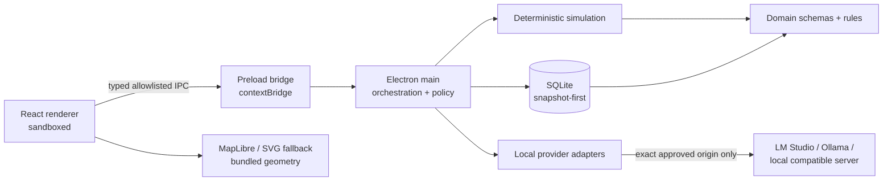
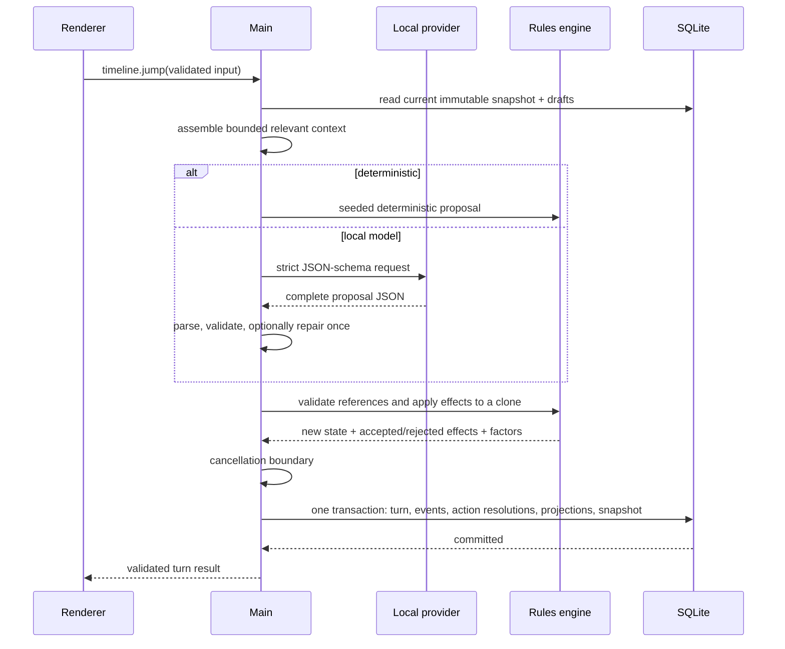

# Architecture

## Boundaries

Pax Localia is one desktop application, not a collection of services.

- `packages/domain` imports neither Electron nor React. It owns branded IDs,
  Zod schemas, IPC contracts, canonical serialization, and date arithmetic.
- `packages/simulation` imports only the domain package. It owns seeded random
  behavior, effect validation/application, deterministic proposals, turn
  resolution, and factual memory extraction.
- `packages/ai` imports the domain package. It owns endpoint policy, context
  selection, provider adapters, streaming parsers, JSON-schema validation, and
  sanitized diagnostics. It has no filesystem, shell, database, or model tools.
- `packages/database` is main-process-only. It owns SQLite migrations,
  repositories, indexed projections, snapshots, and transactions.
- `packages/scenario-sdk` operates on byte arrays. Native dialogs and paths
  remain in the main process.
- `packages/map-data` exposes immutable bundled atomic geometry independently of
  React state.
- `apps/desktop/src/preload` exposes named methods; it does not expose generic
  `send`, `invoke`, event, filesystem, process, or environment access.
- `apps/desktop/src/renderer` receives validated DTOs and never opens SQLite or
  local files directly.

## Why snapshot-first persistence

Each branch stores its current canonical world JSON and an immutable snapshot
for every completed turn. Indexed projection tables (`actors`, `regions`,
`relationships`, and others) support focused queries and diagnostics.

This favors reliable rewind/export/corruption detection over reconstructing a
long timeline from mutable rows. The cost is duplicate compressed logical
state. The bundled scenarios are deliberately small, and the schema leaves room
for snapshot compression without changing game semantics.

Events, actions, conversations, and turns remain normalized and indexed.
Current-state projections can be regenerated from a valid snapshot; snapshots
are the authority.

## Transactional turn flow

No database state changes during context assembly or model generation.
Cancellation before commit preserves the prior snapshot and draft rows.
Semantic validation failure never partially applies output. Within an otherwise
valid proposal, each individual effect records typed acceptance/rejection and
its resulting deltas.

## Database configuration

Migration startup enables:

- `PRAGMA foreign_keys = ON`
- `PRAGMA journal_mode = WAL`
- `PRAGMA busy_timeout = 5000`
- `PRAGMA synchronous = NORMAL`

Migrations are ordered under `packages/database/src/migrations.ts` and executed
inside a transaction. An existing older database is copied before migration.
`PRAGMA user_version` rejects a database newer than the application.

The current schema includes settings, scenario/version/assets, games, branches,
turns, snapshots, projections, actions, events, conversations/messages,
commitments, memory summaries, AI request metadata, import history, and model
probe cache tables.

## Native packaging

The root package is the Forge release boundary. Vite bundles all TypeScript
workspaces and renderer JavaScript. `better-sqlite3` is the sole external
production module. Forge:

1. rebuilds it for the exact Electron ABI;
2. copies only `better-sqlite3`, `bindings`, and `file-uri-to-path` through the
   Vite package allowlist;
3. unpacks native `.node` binaries from ASAR;
4. applies Electron fuses after packaging.

Release fuses disable Run-as-Node, Node option environment variables, CLI
inspection, and non-ASAR loading while enabling cookie encryption and embedded
ASAR integrity.

Playwright cannot attach to that fuse-hardened binary because it uses the Node
inspector. E2E therefore runs the same production Vite bundles through the
development Electron executable. A separate marker-based smoke command launches
the actual packaged binary and confirms both SQLite initialization and renderer
load without enabling inspector access.

## Performance shape

- Map geometry lives outside frequent renderer world updates.
- IPC methods return query-sized DTOs. Draft operations do not resend arbitrary
  filesystem or database objects.
- Event feeds reveal results in batches of 100.
- AI context includes directly involved actors/regions, active conflicts,
  commitments, selected chat, and bounded severe/recent events rather than the
  whole database.
- Simulation applies to a cloned pure state and performs one synchronous SQLite
  transaction only after validation.
